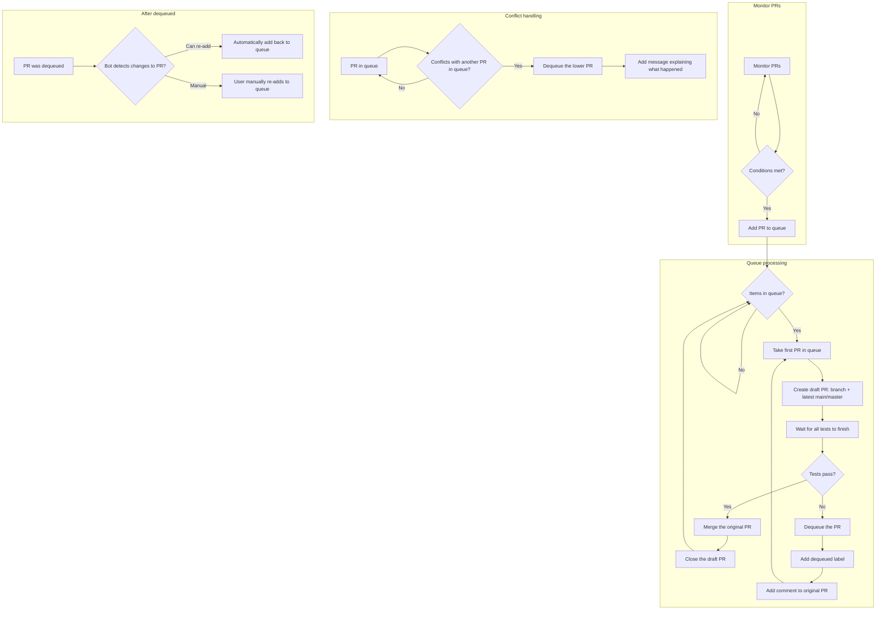
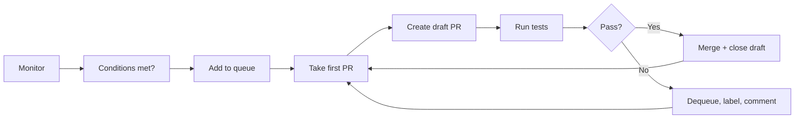
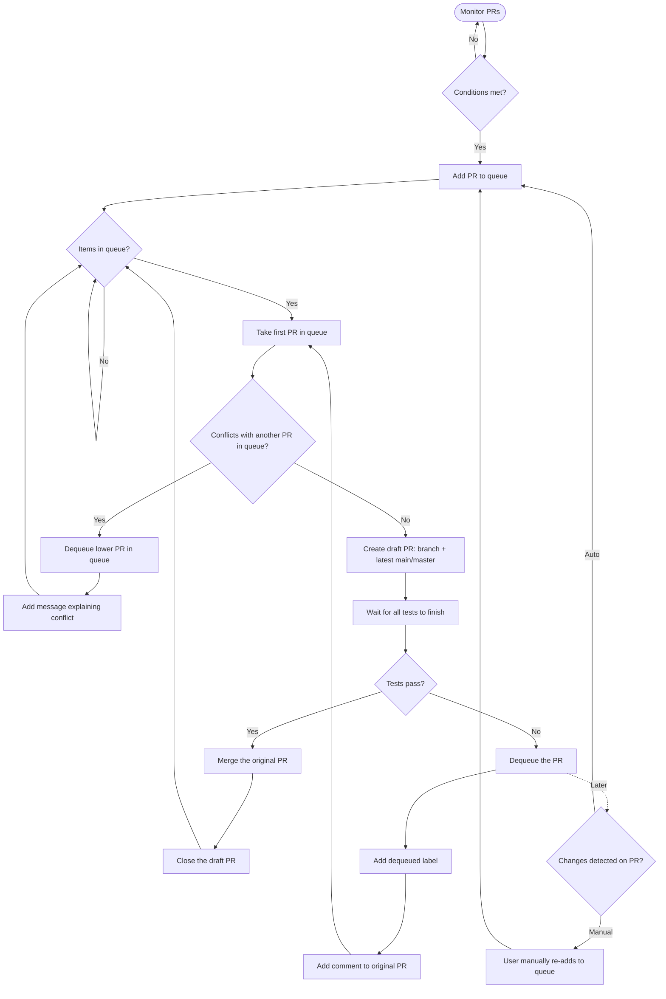

# Mergify Merge Queue Process

## Simplified linear view

## Full process (single diagram)

---

**Legend**
- **Happy path:** Conditions met → add to queue → create draft → tests pass → merge.
- **Failure path:** Tests fail → dequeue, label, comment → process next PR.
- **Conflict:** PR conflicts with another in queue → lower PR is dequeued with message.
- **Re-queue:** After dequeued, PR can re-enter via bot (if changes allow) or manual re-add.
